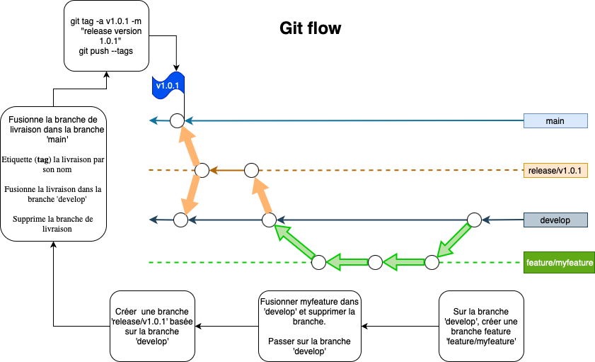

# DEX

The aim of the project is to create a DEX for swap tokens, including fees, liquidy pools and staking

## Description

### Frontend

    - React
    - Typescript

### Backend

    - Go
    - PostgreSQL

## CI/CD

### CI

    - Dockerfile
    - Docker compose yaml file
    - Github Action on push: Build images and push them on private registry
    - Unit Tests
    - Integration Tests

### Deployment

    - Vercel or Netlify
    - Cloud DB
    - Sitemaps

## git flow

Branch for production releases: main

Branch for 'next release' development: develop

Branch for features: feature/X*

Branch for releases: release/vX.X.X

Branch protection rule:
- Require a pull request before merging on 'main' branch

*git flow steps*:
- Create a feature branch 'feature/X*' from 'develop' branch (for example feature/login)
- Checkout to this new branch and commit on it
- Finish up a feature :
  - Merges it into 'develop'
  - Removes the feature branch
  - Switches back to 'develop' branch

- Switched to a new branch 'release/vX.X.X' (for example release/v1.0.1)
- Finish up a release:
  - Tags it with its name
  - Create a pull request for 'release/vX.X.X' on Github to merge this branch into 'main' branch
  - Back-merges the release into 'develop'
  - Removes the release branch

